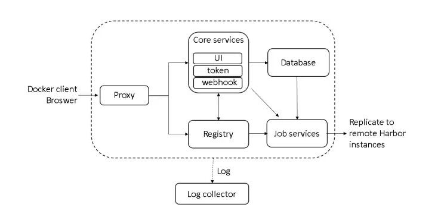
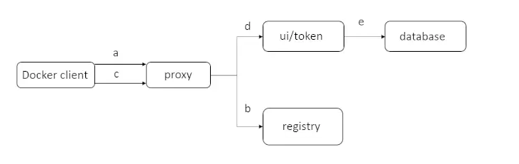
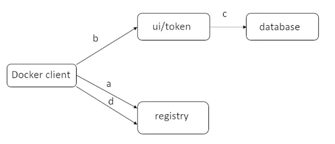

# harbor 架构
## 架构



如上图所示，harbor 包含了6个组件：

- **Proxy:** 例如registry,UI,TokenService,都在Proxy之后。Proxy负责转发从浏览器或docker client的请求到后
台服务。
- **Registry:** 负责存储docker 镜像和docker的pull/push请求。因为Harbor的访问控制,registry会引导client去
tokenService获取一个有效的token来执行pull/push请求
- **Core services:** harbor的核心功能,主要提供一下服务：
    + **UI:** 给用户提供一个图形化界面去管理镜像。
    + **WebHook：** webhook 是registry中的一种机制,因此镜像状态的改变,会做出相应的处理如更新日志,复制等操作
    + **TokenService：** 若请求为携带token,Registry会将请求转发到该服务中进行权限认证
- **job services:** 用于镜像复制，可以将本地镜像复制(同步)到其他harbor实例。
- **log collector:** 日志收集中心

## docker login流程

假设docker部署在`192.168.1.10`上。用户使用docker login命令请求harbor：

```bash
 $ docker login 192.168.1.10
``` 

在用户输入用户名密码后，docker client 将会发送一个Get 请求到 `192.168.1.10/v2/`。将会按照以下步骤进行：



1. 首先请求被proxy容器监听的80端口接收,nginx在这个容器中将请求转发到Registry容器中
2. Registry容器配置了基于token的权限认证，因此会返回一个401的状态码，提示docker client去指定的url获取一个有效的token
。在harbor中这个url指向了Core Services提供的token service。
3. 当docker client 接收到错误码，重新发送一个根据Http规范的基本认证并在Header中嵌入了用户名密码的请求
4. 此请求通过转发80端口后,Nginx根据预先配置的规则再次将该请求转发到UI容器, token service 在UI容器中接收请求，并获取用户名密码
5. 获取用户名密码后,token service 进行权限认证（内部数据库/LDAP），若认证通过 则会在HttpResponse的body中返回一个由私钥生成的token

至此docker login流程结束 docker会将用户名密码编码后存储到隐藏文件中

## docker push 流程


用户登录成功后，一个可以通过push命令将docker 镜像发送到Harbor：
```bash
$ docker push 192.168.1.10/library/hello-world
```
1. 首先,docker client 类似login的流程请求registry,返回一个token service的Url
2. 随后，当与token service联系时， docker client 提供附加额外的信息来获取该镜像（library/hello-world）push操作的token
3. 接收到nginx转发的请求后，token service 去数据库查询该用户的是否由权限push该镜像。如果权限允许，将会对push操作的信息进行编码，并使用私钥进行签名，生成token返回给docker client
4. 最后，docker client获取token后，发送push请求到registry。Registry收到请求后用公钥进行解码并验证其内容，如果registry发现token有效，则镜像开始传数步骤  

