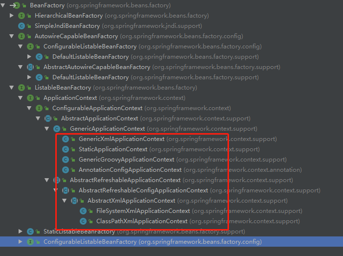

# FactoryBean 的作用
一般情况下Spring 通过反射机制利用class属性指定实现类来实例化bean,在某些特定的情况下,这种方式受限制,如果按照传统的方式, 可能需要在配置文件中配置大量的信息,灵活性受到限制。为此Spring 提供了FactoryBean的工厂类接口,用户可通过实现该接口来定制实例化Bean的逻辑
```java


package org.springframework.beans.factory;

import org.springframework.lang.Nullable;


public interface FactoryBean<T> {


    @Nullable
    T getObject() throws Exception;


    @Nullable
    Class<?> getObjectType();


    default boolean isSingleton() {
        return true;
    }

}


```

该接口定义了3个方法：
+ **T getObject():** 返回有FactoryBean创建的Bean实例,如果是isSingleton返回的是true，则该实例会被Spring容器放到单例缓存中
+ **boolean isSingleton():** 返回该FactoryBean创建的Bean实例的作用域是Singleton还是Prototype
+ **Class<?> getObjectType():** 返回该FactoryBean创建的Bean的类型

当我们将该FactoryBean的实现类放到Spring 的容器中，通过getBean()方法返回的不是FactoryBean本身,而是getObject（）方法返回对象。
以下为测试代码：
```java
package com.vic.springdemo.model;

import org.springframework.beans.factory.annotation.Autowired;

/**
 * Color
 *
 * @author Vic
 * @date 2019/7/15
 */
public class Color {

    private String color;

    public String getColor() {
        return color;
    }

    public void setColor(String color) {
        this.color = color;
    }
}

```

接下来是个现实了FactroyBean的ColorFactoryBean的方法：
```java
package com.vic.springdemo.config;

import com.vic.springdemo.model.Color;
import org.springframework.beans.factory.FactoryBean;

/**
 * ColorFactoryBean
 *
 * @author Vic
 * @date 2019/8/1
 */
public class ColorFactoryBean implements FactoryBean<Color> {


    @Override
    public Color getObject() throws Exception {
        Color color = new Color();
        color.setColor("Red");
        return color;
    }

    @Override
    public Class<?> getObjectType() {
        return Color.class;
    }
    
}


```
并将其通过@Import的方式将ColorFactoryBean注册到Spring容器中
```java
package com.vic.springdemo.config;

import org.springframework.context.annotation.Configuration;
import org.springframework.context.annotation.Import;

/**
 * BeanConfig
 *
 * @author Vic
 * @date 2019/7/15
 */
@Configuration
@Import(ColorFactoryBean.class)
public class BeanConfig {
}

```

容器中有了ColorFactoryBean后我们可以通过getBean的方式来获取Color了
```java
      @Test
    public void contextLoads() throws Exception {
        ApplicationContext applicationContext = new AnnotationConfigApplicationContext(BeanConfig.class);
        //Arrays.stream(applicationContext.getBeanDefinitionNames()).forEach(System.out::println);
        Color color = (Color) applicationContext.getBean("com.vic.springdemo.config.ColorFactoryBean");
        Color color2 = (Color) applicationContext.getBean("com.vic.springdemo.config.ColorFactoryBean");
        System.out.println("isSingleton ?" + (color ==color2));
        System.out.println("color is" + color.getColor());
    }

```
输出结果
```

isSingleton？ true
color isRed

```

当调用getBean("com.vic.springdemo.config.ColorFactoryBean")时，Spring通过反射机制发现ColorFactoryBean实现了FactoryBean接口，这时Spring就会调用getObject()方法将对象返回（如果调到getObject()方法的？请看这里[spring创建bean的流程(一)](./spring创建bean的流程(一).md)）。若想获取ColorFactoryBean 实例,则需要在BeanName前加个&符号,例如getBean("&com.vic.springdemo.config.ColorFactoryBean").

##那么Spring中FactoryBean和BeanFactory有什么区别呢？
BeanFactory继承图：

+ **BeanFactory:** 定义了IOC最基本的形态,给IOC容器提供了规范,如上图它是所有IOC容器最底层的接口
+ **FactoryBean:** 给IOC容器获取Bean实例提供了更加灵活的方式
BeanFactory是个 IOC 容器用于管理各个Bean。FactoryBean是个特殊的Bean它也有IOC管理，它的特殊之处在于可以产生其他的Bean。

